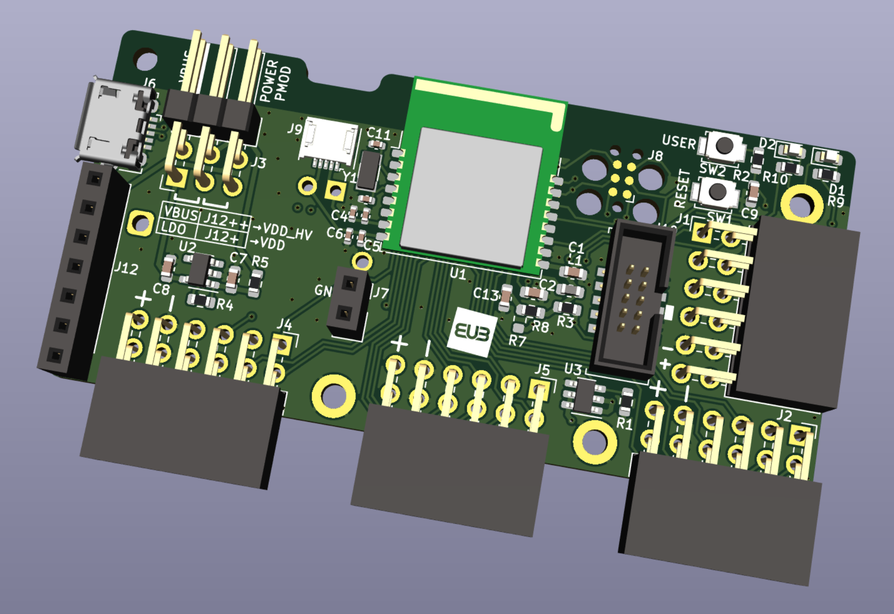

# Kite-nRF52840

## Functionality
- Bluetooth 5.3 SoC (Nordic nRF52840)
- Four 12-pin female connectors
  - Digilent Pmod™ Compatible
  - One port with controllable VDD supply voltage
- +3.3V LDO regulator
- USB Micro B connector for data and/or power
- Two NFC antenna connectors
  - Nordic flex PCB antenna port
  - 2-pin, 2.54mm pitch, plated through holes
- Configurable power supply source
  - USB Micro B +5V
  - VDD_HV pin header (2.5V to 5.5V)
  - VDD pin header (1.7V to 3.6V)
  - CR2032 coin cell battery
- Two SWD debug connectors
  - 6-pin Tag-Connect (TC2030)
  - 10-pin Cortex Debug
- Two LEDs (green, amber)
- Two buttons (reset, user)

## Board releases
- [[v1.0] - 2023-04-27](kite-nrf52840-mfg-v1.0-c81fdbb-2023-06-14)
